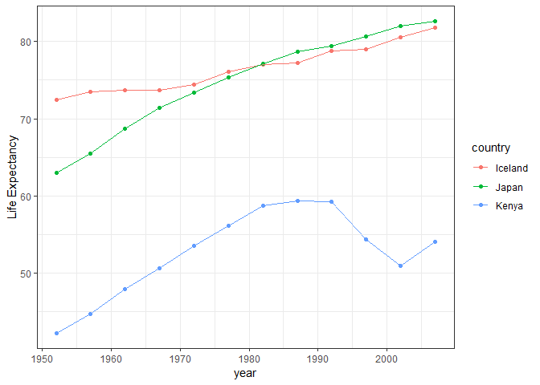
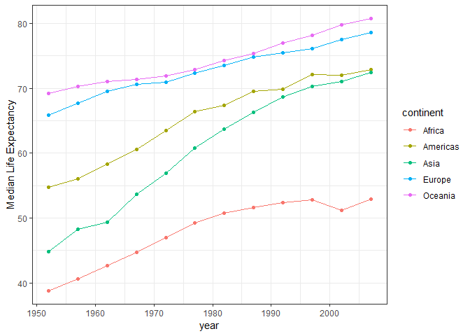

HW04
================

Homework 04: Tidy data and joins
================================

Load packages

``` r
suppressPackageStartupMessages(library(tidyverse))
suppressPackageStartupMessages(library(gapminder))
```

Data Reshaping Prompts (and relationship to aggregation)
--------------------------------------------------------

### Activity 2

Make a tibble with one row per year and columns for life expectancy for two or more countries.

``` r
gap_subset <- gapminder %>%
  filter(country %in% c("Iceland", "Japan", "Kenya")) %>%
  select(country, year, lifeExp)

gap_subset %>%
  knitr::kable()
```

| country |  year|  lifeExp|
|:--------|-----:|--------:|
| Iceland |  1952|   72.490|
| Iceland |  1957|   73.470|
| Iceland |  1962|   73.680|
| Iceland |  1967|   73.730|
| Iceland |  1972|   74.460|
| Iceland |  1977|   76.110|
| Iceland |  1982|   76.990|
| Iceland |  1987|   77.230|
| Iceland |  1992|   78.770|
| Iceland |  1997|   78.950|
| Iceland |  2002|   80.500|
| Iceland |  2007|   81.757|
| Japan   |  1952|   63.030|
| Japan   |  1957|   65.500|
| Japan   |  1962|   68.730|
| Japan   |  1967|   71.430|
| Japan   |  1972|   73.420|
| Japan   |  1977|   75.380|
| Japan   |  1982|   77.110|
| Japan   |  1987|   78.670|
| Japan   |  1992|   79.360|
| Japan   |  1997|   80.690|
| Japan   |  2002|   82.000|
| Japan   |  2007|   82.603|
| Kenya   |  1952|   42.270|
| Kenya   |  1957|   44.686|
| Kenya   |  1962|   47.949|
| Kenya   |  1967|   50.654|
| Kenya   |  1972|   53.559|
| Kenya   |  1977|   56.155|
| Kenya   |  1982|   58.766|
| Kenya   |  1987|   59.339|
| Kenya   |  1992|   59.285|
| Kenya   |  1997|   54.407|
| Kenya   |  2002|   50.992|
| Kenya   |  2007|   54.110|

Here we can see the gapminder subset with 3 countries in a long format (with year and lifeExp).

``` r
gap_subset %>%
  spread(key = "country", value = "lifeExp") %>%
  knitr::kable()
```

|  year|  Iceland|   Japan|   Kenya|
|-----:|--------:|-------:|-------:|
|  1952|   72.490|  63.030|  42.270|
|  1957|   73.470|  65.500|  44.686|
|  1962|   73.680|  68.730|  47.949|
|  1967|   73.730|  71.430|  50.654|
|  1972|   74.460|  73.420|  53.559|
|  1977|   76.110|  75.380|  56.155|
|  1982|   76.990|  77.110|  58.766|
|  1987|   77.230|  78.670|  59.339|
|  1992|   78.770|  79.360|  59.285|
|  1997|   78.950|  80.690|  54.407|
|  2002|   80.500|  82.000|  50.992|
|  2007|   81.757|  82.603|  54.110|

After `spread`, we can see that the columns are the lifeExp for the 3 countries and each row is a year.

``` r
gap_subset %>%
  ggplot(aes(x = year, y = lifeExp, color = country)) +
  geom_point() +
  geom_line() +
  theme_bw() +
  ylab("Life Expectancy")
```



Now we have a scatter plot with line to visualize. Note, I have changed the theme and the axis label on the Y.

### Activity 3

Compute some measure of life expectancy (mean? median? min? max?) for all possible combinations of continent and year. Reshape that to have one row per year and one variable for each continent. Or the other way around: one row per continent and one variable per year.

``` r
med_lifeEx <- gapminder %>%
  group_by(continent, year) %>%
  summarise(med = median(lifeExp))

med_lifeEx %>%
  knitr::kable()
```

| continent |  year|      med|
|:----------|-----:|--------:|
| Africa    |  1952|  38.8330|
| Africa    |  1957|  40.5925|
| Africa    |  1962|  42.6305|
| Africa    |  1967|  44.6985|
| Africa    |  1972|  47.0315|
| Africa    |  1977|  49.2725|
| Africa    |  1982|  50.7560|
| Africa    |  1987|  51.6395|
| Africa    |  1992|  52.4290|
| Africa    |  1997|  52.7590|
| Africa    |  2002|  51.2355|
| Africa    |  2007|  52.9265|
| Americas  |  1952|  54.7450|
| Americas  |  1957|  56.0740|
| Americas  |  1962|  58.2990|
| Americas  |  1967|  60.5230|
| Americas  |  1972|  63.4410|
| Americas  |  1977|  66.3530|
| Americas  |  1982|  67.4050|
| Americas  |  1987|  69.4980|
| Americas  |  1992|  69.8620|
| Americas  |  1997|  72.1460|
| Americas  |  2002|  72.0470|
| Americas  |  2007|  72.8990|
| Asia      |  1952|  44.8690|
| Asia      |  1957|  48.2840|
| Asia      |  1962|  49.3250|
| Asia      |  1967|  53.6550|
| Asia      |  1972|  56.9500|
| Asia      |  1977|  60.7650|
| Asia      |  1982|  63.7390|
| Asia      |  1987|  66.2950|
| Asia      |  1992|  68.6900|
| Asia      |  1997|  70.2650|
| Asia      |  2002|  71.0280|
| Asia      |  2007|  72.3960|
| Europe    |  1952|  65.9000|
| Europe    |  1957|  67.6500|
| Europe    |  1962|  69.5250|
| Europe    |  1967|  70.6100|
| Europe    |  1972|  70.8850|
| Europe    |  1977|  72.3350|
| Europe    |  1982|  73.4900|
| Europe    |  1987|  74.8150|
| Europe    |  1992|  75.4510|
| Europe    |  1997|  76.1160|
| Europe    |  2002|  77.5365|
| Europe    |  2007|  78.6085|
| Oceania   |  1952|  69.2550|
| Oceania   |  1957|  70.2950|
| Oceania   |  1962|  71.0850|
| Oceania   |  1967|  71.3100|
| Oceania   |  1972|  71.9100|
| Oceania   |  1977|  72.8550|
| Oceania   |  1982|  74.2900|
| Oceania   |  1987|  75.3200|
| Oceania   |  1992|  76.9450|
| Oceania   |  1997|  78.1900|
| Oceania   |  2002|  79.7400|
| Oceania   |  2007|  80.7195|

Here we can see the median lifeExp for each continent each year. It is in a long format.

``` r
med_lifeEx %>%
  spread(key = "continent", value = "med") %>%
  knitr::kable()
```

|  year|   Africa|  Americas|    Asia|   Europe|  Oceania|
|-----:|--------:|---------:|-------:|--------:|--------:|
|  1952|  38.8330|    54.745|  44.869|  65.9000|  69.2550|
|  1957|  40.5925|    56.074|  48.284|  67.6500|  70.2950|
|  1962|  42.6305|    58.299|  49.325|  69.5250|  71.0850|
|  1967|  44.6985|    60.523|  53.655|  70.6100|  71.3100|
|  1972|  47.0315|    63.441|  56.950|  70.8850|  71.9100|
|  1977|  49.2725|    66.353|  60.765|  72.3350|  72.8550|
|  1982|  50.7560|    67.405|  63.739|  73.4900|  74.2900|
|  1987|  51.6395|    69.498|  66.295|  74.8150|  75.3200|
|  1992|  52.4290|    69.862|  68.690|  75.4510|  76.9450|
|  1997|  52.7590|    72.146|  70.265|  76.1160|  78.1900|
|  2002|  51.2355|    72.047|  71.028|  77.5365|  79.7400|
|  2007|  52.9265|    72.899|  72.396|  78.6085|  80.7195|

Here we can see it in a `spread` form with one column per continent.

``` r
med_lifeEx %>%
  spread(key = "continent", value = "med") %>%
  gather(key = "continent", value = "med", -"year") %>%
  knitr::kable()
```

|  year| continent |      med|
|-----:|:----------|--------:|
|  1952| Africa    |  38.8330|
|  1957| Africa    |  40.5925|
|  1962| Africa    |  42.6305|
|  1967| Africa    |  44.6985|
|  1972| Africa    |  47.0315|
|  1977| Africa    |  49.2725|
|  1982| Africa    |  50.7560|
|  1987| Africa    |  51.6395|
|  1992| Africa    |  52.4290|
|  1997| Africa    |  52.7590|
|  2002| Africa    |  51.2355|
|  2007| Africa    |  52.9265|
|  1952| Americas  |  54.7450|
|  1957| Americas  |  56.0740|
|  1962| Americas  |  58.2990|
|  1967| Americas  |  60.5230|
|  1972| Americas  |  63.4410|
|  1977| Americas  |  66.3530|
|  1982| Americas  |  67.4050|
|  1987| Americas  |  69.4980|
|  1992| Americas  |  69.8620|
|  1997| Americas  |  72.1460|
|  2002| Americas  |  72.0470|
|  2007| Americas  |  72.8990|
|  1952| Asia      |  44.8690|
|  1957| Asia      |  48.2840|
|  1962| Asia      |  49.3250|
|  1967| Asia      |  53.6550|
|  1972| Asia      |  56.9500|
|  1977| Asia      |  60.7650|
|  1982| Asia      |  63.7390|
|  1987| Asia      |  66.2950|
|  1992| Asia      |  68.6900|
|  1997| Asia      |  70.2650|
|  2002| Asia      |  71.0280|
|  2007| Asia      |  72.3960|
|  1952| Europe    |  65.9000|
|  1957| Europe    |  67.6500|
|  1962| Europe    |  69.5250|
|  1967| Europe    |  70.6100|
|  1972| Europe    |  70.8850|
|  1977| Europe    |  72.3350|
|  1982| Europe    |  73.4900|
|  1987| Europe    |  74.8150|
|  1992| Europe    |  75.4510|
|  1997| Europe    |  76.1160|
|  2002| Europe    |  77.5365|
|  2007| Europe    |  78.6085|
|  1952| Oceania   |  69.2550|
|  1957| Oceania   |  70.2950|
|  1962| Oceania   |  71.0850|
|  1967| Oceania   |  71.3100|
|  1972| Oceania   |  71.9100|
|  1977| Oceania   |  72.8550|
|  1982| Oceania   |  74.2900|
|  1987| Oceania   |  75.3200|
|  1992| Oceania   |  76.9450|
|  1997| Oceania   |  78.1900|
|  2002| Oceania   |  79.7400|
|  2007| Oceania   |  80.7195|

We can see that `gather` and reverts `spread` back to the original form.

``` r
med_lifeEx %>%
    ggplot(aes(x = year, y = med, color = continent)) +
  geom_point() +
  geom_line() +
  theme_bw() +
  ylab("Median Life Expectancy")
```



Now we have a scatter plot with line to visualize. Note, I have changed the theme and the axis label on the Y. Additionally, the gathered format is easier for plotting, but the spread format is nicer for viewing in a table.

Join Prompts (join, merge, look up)
-----------------------------------

### Activity 1

Create a second data frame, complementary to Gapminder. Join this with (part of) Gapminder using a dplyr join function and make some observations about the process and result. Explore the different types of joins. Examples of a second data frame you could build: One row per country, a country variable and one or more variables with extra info, such as language spoken, NATO membership, national animal, or capitol city.

First look at the gapminder col names.

``` r
colnames(gapminder)
```

    ## [1] "country"   "continent" "year"      "lifeExp"   "pop"       "gdpPercap"

Read in a text file with country capital cities.

``` r
country_cap <- read_delim("Country_capitals.txt", delim = "$", col_names = TRUE)
```

    ## Parsed with column specification:
    ## cols(
    ##   country = col_character(),
    ##   capital = col_character()
    ## )

``` r
head(country_cap, 20) %>%
  knitr::kable()
```

| country             | capital          |
|:--------------------|:-----------------|
| Afghanistan         | Kabul            |
| Albania             | Tirana           |
| Algeria             | Algiers          |
| Andorra             | Andorra la Vella |
| Angola              | Luanda           |
| Antigua and Barbuda | Saint John's     |
| Argentina           | Buenos Aires     |
| Armenia             | Yerevan          |
| Australia           | Canberra         |
| Austria             | Vienna           |
| Azerbaijan          | Baku             |
| The Bahamas         | Nassau           |
| Bahrain             | Manama           |
| Bangladesh          | Dhaka            |
| Barbados            | Bridgetown       |
| Belarus             | Minsk            |
| Belgium             | Brussels         |
| Belize              | Belmopan         |
| Benin               | Porto-Novo       |
| Bhutan              | Thimphu          |

Here, I show that we can use `read_delim` and I specifically formatted the file with "$" as the delimeter. This file has countries and capitals (shown with `head` of 20). I call this `country_cap`.

``` r
gapminder %>%
  filter(year == 1952) %>%
  left_join(country_cap, by = "country") %>%
  knitr::kable()
```

    ## Warning: Column `country` joining factor and character vector, coercing
    ## into character vector

| country                  | continent |  year|  lifeExp|        pop|    gdpPercap| capital                            |
|:-------------------------|:----------|-----:|--------:|----------:|------------:|:-----------------------------------|
| Afghanistan              | Asia      |  1952|   28.801|    8425333|     779.4453| Kabul                              |
| Albania                  | Europe    |  1952|   55.230|    1282697|    1601.0561| Tirana                             |
| Algeria                  | Africa    |  1952|   43.077|    9279525|    2449.0082| Algiers                            |
| Angola                   | Africa    |  1952|   30.015|    4232095|    3520.6103| Luanda                             |
| Argentina                | Americas  |  1952|   62.485|   17876956|    5911.3151| Buenos Aires                       |
| Australia                | Oceania   |  1952|   69.120|    8691212|   10039.5956| Canberra                           |
| Austria                  | Europe    |  1952|   66.800|    6927772|    6137.0765| Vienna                             |
| Bahrain                  | Asia      |  1952|   50.939|     120447|    9867.0848| Manama                             |
| Bangladesh               | Asia      |  1952|   37.484|   46886859|     684.2442| Dhaka                              |
| Belgium                  | Europe    |  1952|   68.000|    8730405|    8343.1051| Brussels                           |
| Benin                    | Africa    |  1952|   38.223|    1738315|    1062.7522| Porto-Novo                         |
| Bolivia                  | Americas  |  1952|   40.414|    2883315|    2677.3263| La Paz, Sucre                      |
| Bosnia and Herzegovina   | Europe    |  1952|   53.820|    2791000|     973.5332| Sarajevo                           |
| Botswana                 | Africa    |  1952|   47.622|     442308|     851.2411| Gaborone                           |
| Brazil                   | Americas  |  1952|   50.917|   56602560|    2108.9444| Brasilia                           |
| Bulgaria                 | Europe    |  1952|   59.600|    7274900|    2444.2866| Sofia                              |
| Burkina Faso             | Africa    |  1952|   31.975|    4469979|     543.2552| Ouagadougou                        |
| Burundi                  | Africa    |  1952|   39.031|    2445618|     339.2965| Bujumbura                          |
| Cambodia                 | Asia      |  1952|   39.417|    4693836|     368.4693| Phnom Penh                         |
| Cameroon                 | Africa    |  1952|   38.523|    5009067|    1172.6677| Yaounde                            |
| Canada                   | Americas  |  1952|   68.750|   14785584|   11367.1611| Ottawa                             |
| Central African Republic | Africa    |  1952|   35.463|    1291695|    1071.3107| Bangui                             |
| Chad                     | Africa    |  1952|   38.092|    2682462|    1178.6659| N'Djamena                          |
| Chile                    | Americas  |  1952|   54.745|    6377619|    3939.9788| Santiago                           |
| China                    | Asia      |  1952|   44.000|  556263527|     400.4486| Beijing                            |
| Colombia                 | Americas  |  1952|   50.643|   12350771|    2144.1151| Bogota                             |
| Comoros                  | Africa    |  1952|   40.715|     153936|    1102.9909| Moroni                             |
| Congo, Dem. Rep.         | Africa    |  1952|   39.143|   14100005|     780.5423| NA                                 |
| Congo, Rep.              | Africa    |  1952|   42.111|     854885|    2125.6214| NA                                 |
| Costa Rica               | Americas  |  1952|   57.206|     926317|    2627.0095| San Jose                           |
| Cote d'Ivoire            | Africa    |  1952|   40.477|    2977019|    1388.5947| Yamoussoukro                       |
| Croatia                  | Europe    |  1952|   61.210|    3882229|    3119.2365| Zagreb                             |
| Cuba                     | Americas  |  1952|   59.421|    6007797|    5586.5388| Havana                             |
| Czech Republic           | Europe    |  1952|   66.870|    9125183|    6876.1403| Prague                             |
| Denmark                  | Europe    |  1952|   70.780|    4334000|    9692.3852| Copenhagen                         |
| Djibouti                 | Africa    |  1952|   34.812|      63149|    2669.5295| Djibouti                           |
| Dominican Republic       | Americas  |  1952|   45.928|    2491346|    1397.7171| Santo Domingo                      |
| Ecuador                  | Americas  |  1952|   48.357|    3548753|    3522.1107| Quito                              |
| Egypt                    | Africa    |  1952|   41.893|   22223309|    1418.8224| Cairo                              |
| El Salvador              | Americas  |  1952|   45.262|    2042865|    3048.3029| San Salvador                       |
| Equatorial Guinea        | Africa    |  1952|   34.482|     216964|     375.6431| Malabo                             |
| Eritrea                  | Africa    |  1952|   35.928|    1438760|     328.9406| Asmara                             |
| Ethiopia                 | Africa    |  1952|   34.078|   20860941|     362.1463| Addis Ababa                        |
| Finland                  | Europe    |  1952|   66.550|    4090500|    6424.5191| Helsinki                           |
| France                   | Europe    |  1952|   67.410|   42459667|    7029.8093| Paris                              |
| Gabon                    | Africa    |  1952|   37.003|     420702|    4293.4765| Libreville                         |
| Gambia                   | Africa    |  1952|   30.000|     284320|     485.2307| NA                                 |
| Germany                  | Europe    |  1952|   67.500|   69145952|    7144.1144| Berlin                             |
| Ghana                    | Africa    |  1952|   43.149|    5581001|     911.2989| Accra                              |
| Greece                   | Europe    |  1952|   65.860|    7733250|    3530.6901| Athens                             |
| Guatemala                | Americas  |  1952|   42.023|    3146381|    2428.2378| Guatemala City                     |
| Guinea                   | Africa    |  1952|   33.609|    2664249|     510.1965| Conakry                            |
| Guinea-Bissau            | Africa    |  1952|   32.500|     580653|     299.8503| Bissau                             |
| Haiti                    | Americas  |  1952|   37.579|    3201488|    1840.3669| Port-au-Prince                     |
| Honduras                 | Americas  |  1952|   41.912|    1517453|    2194.9262| Tegucigalpa                        |
| Hong Kong, China         | Asia      |  1952|   60.960|    2125900|    3054.4212| NA                                 |
| Hungary                  | Europe    |  1952|   64.030|    9504000|    5263.6738| Budapest                           |
| Iceland                  | Europe    |  1952|   72.490|     147962|    7267.6884| Reykjavik                          |
| India                    | Asia      |  1952|   37.373|  372000000|     546.5657| New Delhi                          |
| Indonesia                | Asia      |  1952|   37.468|   82052000|     749.6817| Jakarta                            |
| Iran                     | Asia      |  1952|   44.869|   17272000|    3035.3260| Tehran                             |
| Iraq                     | Asia      |  1952|   45.320|    5441766|    4129.7661| Baghdad                            |
| Ireland                  | Europe    |  1952|   66.910|    2952156|    5210.2803| Dublin                             |
| Israel                   | Asia      |  1952|   65.390|    1620914|    4086.5221| Jerusalem                          |
| Italy                    | Europe    |  1952|   65.940|   47666000|    4931.4042| Rome                               |
| Jamaica                  | Americas  |  1952|   58.530|    1426095|    2898.5309| Kingston                           |
| Japan                    | Asia      |  1952|   63.030|   86459025|    3216.9563| Tokyo                              |
| Jordan                   | Asia      |  1952|   43.158|     607914|    1546.9078| Amman                              |
| Kenya                    | Africa    |  1952|   42.270|    6464046|     853.5409| Nairobi                            |
| Korea, Dem. Rep.         | Asia      |  1952|   50.056|    8865488|    1088.2778| NA                                 |
| Korea, Rep.              | Asia      |  1952|   47.453|   20947571|    1030.5922| NA                                 |
| Kuwait                   | Asia      |  1952|   55.565|     160000|  108382.3529| Kuwait City                        |
| Lebanon                  | Asia      |  1952|   55.928|    1439529|    4834.8041| Beirut                             |
| Lesotho                  | Africa    |  1952|   42.138|     748747|     298.8462| Maseru                             |
| Liberia                  | Africa    |  1952|   38.480|     863308|     575.5730| Monrovia                           |
| Libya                    | Africa    |  1952|   42.723|    1019729|    2387.5481| Tripoli                            |
| Madagascar               | Africa    |  1952|   36.681|    4762912|    1443.0117| Antananarivo                       |
| Malawi                   | Africa    |  1952|   36.256|    2917802|     369.1651| Lilongwe                           |
| Malaysia                 | Asia      |  1952|   48.463|    6748378|    1831.1329| Kuala Lumpur                       |
| Mali                     | Africa    |  1952|   33.685|    3838168|     452.3370| Bamako                             |
| Mauritania               | Africa    |  1952|   40.543|    1022556|     743.1159| Nouakchott                         |
| Mauritius                | Africa    |  1952|   50.986|     516556|    1967.9557| Port Louis                         |
| Mexico                   | Americas  |  1952|   50.789|   30144317|    3478.1255| Mexico City                        |
| Mongolia                 | Asia      |  1952|   42.244|     800663|     786.5669| Ulaanbaatar                        |
| Montenegro               | Europe    |  1952|   59.164|     413834|    2647.5856| Podgorica                          |
| Morocco                  | Africa    |  1952|   42.873|    9939217|    1688.2036| Rabat                              |
| Mozambique               | Africa    |  1952|   31.286|    6446316|     468.5260| Maputo                             |
| Myanmar                  | Asia      |  1952|   36.319|   20092996|     331.0000| NA                                 |
| Namibia                  | Africa    |  1952|   41.725|     485831|    2423.7804| Windhoek                           |
| Nepal                    | Asia      |  1952|   36.157|    9182536|     545.8657| Kathmandu                          |
| Netherlands              | Europe    |  1952|   72.130|   10381988|    8941.5719| Amsterdam                          |
| New Zealand              | Oceania   |  1952|   69.390|    1994794|   10556.5757| Wellington                         |
| Nicaragua                | Americas  |  1952|   42.314|    1165790|    3112.3639| Managua                            |
| Niger                    | Africa    |  1952|   37.444|    3379468|     761.8794| Niamey                             |
| Nigeria                  | Africa    |  1952|   36.324|   33119096|    1077.2819| Abuja                              |
| Norway                   | Europe    |  1952|   72.670|    3327728|   10095.4217| Oslo                               |
| Oman                     | Asia      |  1952|   37.578|     507833|    1828.2303| Muscat                             |
| Pakistan                 | Asia      |  1952|   43.436|   41346560|     684.5971| Islamabad                          |
| Panama                   | Americas  |  1952|   55.191|     940080|    2480.3803| Panama City                        |
| Paraguay                 | Americas  |  1952|   62.649|    1555876|    1952.3087| Asuncion                           |
| Peru                     | Americas  |  1952|   43.902|    8025700|    3758.5234| Lima                               |
| Philippines              | Asia      |  1952|   47.752|   22438691|    1272.8810| Manila                             |
| Poland                   | Europe    |  1952|   61.310|   25730551|    4029.3297| Warsaw                             |
| Portugal                 | Europe    |  1952|   59.820|    8526050|    3068.3199| Lisbon                             |
| Puerto Rico              | Americas  |  1952|   64.280|    2227000|    3081.9598| NA                                 |
| Reunion                  | Africa    |  1952|   52.724|     257700|    2718.8853| NA                                 |
| Romania                  | Europe    |  1952|   61.050|   16630000|    3144.6132| Bucharest                          |
| Rwanda                   | Africa    |  1952|   40.000|    2534927|     493.3239| Kigali                             |
| Sao Tome and Principe    | Africa    |  1952|   46.471|      60011|     879.5836| Sao Tome                           |
| Saudi Arabia             | Asia      |  1952|   39.875|    4005677|    6459.5548| Riyadh                             |
| Senegal                  | Africa    |  1952|   37.278|    2755589|    1450.3570| Dakar                              |
| Serbia                   | Europe    |  1952|   57.996|    6860147|    3581.4594| Belgrade                           |
| Sierra Leone             | Africa    |  1952|   30.331|    2143249|     879.7877| Freetown                           |
| Singapore                | Asia      |  1952|   60.396|    1127000|    2315.1382| Singapore                          |
| Slovak Republic          | Europe    |  1952|   64.360|    3558137|    5074.6591| NA                                 |
| Slovenia                 | Europe    |  1952|   65.570|    1489518|    4215.0417| Ljubljana                          |
| Somalia                  | Africa    |  1952|   32.978|    2526994|    1135.7498| Mogadishu                          |
| South Africa             | Africa    |  1952|   45.009|   14264935|    4725.2955| Pretoria, Cape Town, Bloemfontein  |
| Spain                    | Europe    |  1952|   64.940|   28549870|    3834.0347| Madrid                             |
| Sri Lanka                | Asia      |  1952|   57.593|    7982342|    1083.5320| Colombo, Sri Jayewardenepura Kotte |
| Sudan                    | Africa    |  1952|   38.635|    8504667|    1615.9911| Khartoum                           |
| Swaziland                | Africa    |  1952|   41.407|     290243|    1148.3766| Mbabane                            |
| Sweden                   | Europe    |  1952|   71.860|    7124673|    8527.8447| Stockholm                          |
| Switzerland              | Europe    |  1952|   69.620|    4815000|   14734.2327| Bern                               |
| Syria                    | Asia      |  1952|   45.883|    3661549|    1643.4854| Damascus                           |
| Taiwan                   | Asia      |  1952|   58.500|    8550362|    1206.9479| Taipei                             |
| Tanzania                 | Africa    |  1952|   41.215|    8322925|     716.6501| Dodoma                             |
| Thailand                 | Asia      |  1952|   50.848|   21289402|     757.7974| Bangkok                            |
| Togo                     | Africa    |  1952|   38.596|    1219113|     859.8087| Lome                               |
| Trinidad and Tobago      | Americas  |  1952|   59.100|     662850|    3023.2719| Port-of-Spain                      |
| Tunisia                  | Africa    |  1952|   44.600|    3647735|    1468.4756| Tunis                              |
| Turkey                   | Europe    |  1952|   43.585|   22235677|    1969.1010| Ankara                             |
| Uganda                   | Africa    |  1952|   39.978|    5824797|     734.7535| Kampala                            |
| United Kingdom           | Europe    |  1952|   69.180|   50430000|    9979.5085| London                             |
| United States            | Americas  |  1952|   68.440|  157553000|   13990.4821| NA                                 |
| Uruguay                  | Americas  |  1952|   66.071|    2252965|    5716.7667| Montevideo                         |
| Venezuela                | Americas  |  1952|   55.088|    5439568|    7689.7998| Caracas                            |
| Vietnam                  | Asia      |  1952|   40.412|   26246839|     605.0665| Hanoi                              |
| West Bank and Gaza       | Asia      |  1952|   43.160|    1030585|    1515.5923| NA                                 |
| Yemen, Rep.              | Asia      |  1952|   32.548|    4963829|     781.7176| NA                                 |
| Zambia                   | Africa    |  1952|   42.038|    2672000|    1147.3888| Lusaka                             |
| Zimbabwe                 | Africa    |  1952|   48.451|    3080907|     406.8841| Harare                             |

I first filter `gapminder` for data in 1952. Then I `left_join` with `country_cap`. I can see the `gapminder` entries, but now with a new column of `captial`. We can see some `NA`. This means that the country name was not in `country_cap`.

``` r
gapminder %>%
  filter(year == 1952) %>%
  right_join(country_cap, by = "country") %>%
  knitr::kable()
```

    ## Warning: Column `country` joining factor and character vector, coercing
    ## into character vector

| country                           | continent |  year|  lifeExp|        pop|    gdpPercap| capital                            |
|:----------------------------------|:----------|-----:|--------:|----------:|------------:|:-----------------------------------|
| Afghanistan                       | Asia      |  1952|   28.801|    8425333|     779.4453| Kabul                              |
| Albania                           | Europe    |  1952|   55.230|    1282697|    1601.0561| Tirana                             |
| Algeria                           | Africa    |  1952|   43.077|    9279525|    2449.0082| Algiers                            |
| Andorra                           | NA        |    NA|       NA|         NA|           NA| Andorra la Vella                   |
| Angola                            | Africa    |  1952|   30.015|    4232095|    3520.6103| Luanda                             |
| Antigua and Barbuda               | NA        |    NA|       NA|         NA|           NA| Saint John's                       |
| Argentina                         | Americas  |  1952|   62.485|   17876956|    5911.3151| Buenos Aires                       |
| Armenia                           | NA        |    NA|       NA|         NA|           NA| Yerevan                            |
| Australia                         | Oceania   |  1952|   69.120|    8691212|   10039.5956| Canberra                           |
| Austria                           | Europe    |  1952|   66.800|    6927772|    6137.0765| Vienna                             |
| Azerbaijan                        | NA        |    NA|       NA|         NA|           NA| Baku                               |
| The Bahamas                       | NA        |    NA|       NA|         NA|           NA| Nassau                             |
| Bahrain                           | Asia      |  1952|   50.939|     120447|    9867.0848| Manama                             |
| Bangladesh                        | Asia      |  1952|   37.484|   46886859|     684.2442| Dhaka                              |
| Barbados                          | NA        |    NA|       NA|         NA|           NA| Bridgetown                         |
| Belarus                           | NA        |    NA|       NA|         NA|           NA| Minsk                              |
| Belgium                           | Europe    |  1952|   68.000|    8730405|    8343.1051| Brussels                           |
| Belize                            | NA        |    NA|       NA|         NA|           NA| Belmopan                           |
| Benin                             | Africa    |  1952|   38.223|    1738315|    1062.7522| Porto-Novo                         |
| Bhutan                            | NA        |    NA|       NA|         NA|           NA| Thimphu                            |
| Bolivia                           | Americas  |  1952|   40.414|    2883315|    2677.3263| La Paz, Sucre                      |
| Bosnia and Herzegovina            | Europe    |  1952|   53.820|    2791000|     973.5332| Sarajevo                           |
| Botswana                          | Africa    |  1952|   47.622|     442308|     851.2411| Gaborone                           |
| Brazil                            | Americas  |  1952|   50.917|   56602560|    2108.9444| Brasilia                           |
| Brunei                            | NA        |    NA|       NA|         NA|           NA| Bandar Seri Begawan                |
| Bulgaria                          | Europe    |  1952|   59.600|    7274900|    2444.2866| Sofia                              |
| Burkina Faso                      | Africa    |  1952|   31.975|    4469979|     543.2552| Ouagadougou                        |
| Burundi                           | Africa    |  1952|   39.031|    2445618|     339.2965| Bujumbura                          |
| Cambodia                          | Asia      |  1952|   39.417|    4693836|     368.4693| Phnom Penh                         |
| Cameroon                          | Africa    |  1952|   38.523|    5009067|    1172.6677| Yaounde                            |
| Canada                            | Americas  |  1952|   68.750|   14785584|   11367.1611| Ottawa                             |
| Cape Verde                        | NA        |    NA|       NA|         NA|           NA| Praia                              |
| Central African Republic          | Africa    |  1952|   35.463|    1291695|    1071.3107| Bangui                             |
| Chad                              | Africa    |  1952|   38.092|    2682462|    1178.6659| N'Djamena                          |
| Chile                             | Americas  |  1952|   54.745|    6377619|    3939.9788| Santiago                           |
| China                             | Asia      |  1952|   44.000|  556263527|     400.4486| Beijing                            |
| Colombia                          | Americas  |  1952|   50.643|   12350771|    2144.1151| Bogota                             |
| Comoros                           | Africa    |  1952|   40.715|     153936|    1102.9909| Moroni                             |
| Congo, Republic of the            | NA        |    NA|       NA|         NA|           NA| Brazzaville                        |
| Congo, Democratic Republic of the | NA        |    NA|       NA|         NA|           NA| Kinshasa                           |
| Costa Rica                        | Americas  |  1952|   57.206|     926317|    2627.0095| San Jose                           |
| Cote d'Ivoire                     | Africa    |  1952|   40.477|    2977019|    1388.5947| Yamoussoukro                       |
| Croatia                           | Europe    |  1952|   61.210|    3882229|    3119.2365| Zagreb                             |
| Cuba                              | Americas  |  1952|   59.421|    6007797|    5586.5388| Havana                             |
| Cyprus                            | NA        |    NA|       NA|         NA|           NA| Nicosia                            |
| Czech Republic                    | Europe    |  1952|   66.870|    9125183|    6876.1403| Prague                             |
| Denmark                           | Europe    |  1952|   70.780|    4334000|    9692.3852| Copenhagen                         |
| Djibouti                          | Africa    |  1952|   34.812|      63149|    2669.5295| Djibouti                           |
| Dominica                          | NA        |    NA|       NA|         NA|           NA| Roseau                             |
| Dominican Republic                | Americas  |  1952|   45.928|    2491346|    1397.7171| Santo Domingo                      |
| East Timor (Timor-Leste)          | NA        |    NA|       NA|         NA|           NA| Dili                               |
| Ecuador                           | Americas  |  1952|   48.357|    3548753|    3522.1107| Quito                              |
| Egypt                             | Africa    |  1952|   41.893|   22223309|    1418.8224| Cairo                              |
| El Salvador                       | Americas  |  1952|   45.262|    2042865|    3048.3029| San Salvador                       |
| Equatorial Guinea                 | Africa    |  1952|   34.482|     216964|     375.6431| Malabo                             |
| Eritrea                           | Africa    |  1952|   35.928|    1438760|     328.9406| Asmara                             |
| Estonia                           | NA        |    NA|       NA|         NA|           NA| Tallinn                            |
| Ethiopia                          | Africa    |  1952|   34.078|   20860941|     362.1463| Addis Ababa                        |
| Fiji                              | NA        |    NA|       NA|         NA|           NA| Suva                               |
| Finland                           | Europe    |  1952|   66.550|    4090500|    6424.5191| Helsinki                           |
| France                            | Europe    |  1952|   67.410|   42459667|    7029.8093| Paris                              |
| Gabon                             | Africa    |  1952|   37.003|     420702|    4293.4765| Libreville                         |
| The Gambia                        | NA        |    NA|       NA|         NA|           NA| Banjul                             |
| Georgia                           | NA        |    NA|       NA|         NA|           NA| Tbilisi                            |
| Germany                           | Europe    |  1952|   67.500|   69145952|    7144.1144| Berlin                             |
| Ghana                             | Africa    |  1952|   43.149|    5581001|     911.2989| Accra                              |
| Greece                            | Europe    |  1952|   65.860|    7733250|    3530.6901| Athens                             |
| Grenada                           | NA        |    NA|       NA|         NA|           NA| Saint George's                     |
| Guatemala                         | Americas  |  1952|   42.023|    3146381|    2428.2378| Guatemala City                     |
| Guinea                            | Africa    |  1952|   33.609|    2664249|     510.1965| Conakry                            |
| Guinea-Bissau                     | Africa    |  1952|   32.500|     580653|     299.8503| Bissau                             |
| Guyana                            | NA        |    NA|       NA|         NA|           NA| Georgetown                         |
| Haiti                             | Americas  |  1952|   37.579|    3201488|    1840.3669| Port-au-Prince                     |
| Honduras                          | Americas  |  1952|   41.912|    1517453|    2194.9262| Tegucigalpa                        |
| Hungary                           | Europe    |  1952|   64.030|    9504000|    5263.6738| Budapest                           |
| Iceland                           | Europe    |  1952|   72.490|     147962|    7267.6884| Reykjavik                          |
| India                             | Asia      |  1952|   37.373|  372000000|     546.5657| New Delhi                          |
| Indonesia                         | Asia      |  1952|   37.468|   82052000|     749.6817| Jakarta                            |
| Iran                              | Asia      |  1952|   44.869|   17272000|    3035.3260| Tehran                             |
| Iraq                              | Asia      |  1952|   45.320|    5441766|    4129.7661| Baghdad                            |
| Ireland                           | Europe    |  1952|   66.910|    2952156|    5210.2803| Dublin                             |
| Israel                            | Asia      |  1952|   65.390|    1620914|    4086.5221| Jerusalem                          |
| Italy                             | Europe    |  1952|   65.940|   47666000|    4931.4042| Rome                               |
| Jamaica                           | Americas  |  1952|   58.530|    1426095|    2898.5309| Kingston                           |
| Japan                             | Asia      |  1952|   63.030|   86459025|    3216.9563| Tokyo                              |
| Jordan                            | Asia      |  1952|   43.158|     607914|    1546.9078| Amman                              |
| Kazakhstan                        | NA        |    NA|       NA|         NA|           NA| Astana                             |
| Kenya                             | Africa    |  1952|   42.270|    6464046|     853.5409| Nairobi                            |
| Kiribati                          | NA        |    NA|       NA|         NA|           NA| Tarawa Atoll                       |
| Korea, North                      | NA        |    NA|       NA|         NA|           NA| Pyongyang                          |
| Korea, South                      | NA        |    NA|       NA|         NA|           NA| Seoul                              |
| Kosovo                            | NA        |    NA|       NA|         NA|           NA| Pristina                           |
| Kuwait                            | Asia      |  1952|   55.565|     160000|  108382.3529| Kuwait City                        |
| Kyrgyzstan                        | NA        |    NA|       NA|         NA|           NA| Bishkek                            |
| Laos                              | NA        |    NA|       NA|         NA|           NA| Vientiane                          |
| Latvia                            | NA        |    NA|       NA|         NA|           NA| Riga                               |
| Lebanon                           | Asia      |  1952|   55.928|    1439529|    4834.8041| Beirut                             |
| Lesotho                           | Africa    |  1952|   42.138|     748747|     298.8462| Maseru                             |
| Liberia                           | Africa    |  1952|   38.480|     863308|     575.5730| Monrovia                           |
| Libya                             | Africa    |  1952|   42.723|    1019729|    2387.5481| Tripoli                            |
| Liechtenstein                     | NA        |    NA|       NA|         NA|           NA| Vaduz                              |
| Lithuania                         | NA        |    NA|       NA|         NA|           NA| Vilnius                            |
| Luxembourg                        | NA        |    NA|       NA|         NA|           NA| Luxembourg                         |
| Macedonia                         | NA        |    NA|       NA|         NA|           NA| Skopje                             |
| Madagascar                        | Africa    |  1952|   36.681|    4762912|    1443.0117| Antananarivo                       |
| Malawi                            | Africa    |  1952|   36.256|    2917802|     369.1651| Lilongwe                           |
| Malaysia                          | Asia      |  1952|   48.463|    6748378|    1831.1329| Kuala Lumpur                       |
| Maldives                          | NA        |    NA|       NA|         NA|           NA| Male                               |
| Mali                              | Africa    |  1952|   33.685|    3838168|     452.3370| Bamako                             |
| Malta                             | NA        |    NA|       NA|         NA|           NA| Valletta                           |
| Marshall Islands                  | NA        |    NA|       NA|         NA|           NA| Majuro                             |
| Mauritania                        | Africa    |  1952|   40.543|    1022556|     743.1159| Nouakchott                         |
| Mauritius                         | Africa    |  1952|   50.986|     516556|    1967.9557| Port Louis                         |
| Mexico                            | Americas  |  1952|   50.789|   30144317|    3478.1255| Mexico City                        |
| Micronesia, Federated States of   | NA        |    NA|       NA|         NA|           NA| Palikir                            |
| Moldova                           | NA        |    NA|       NA|         NA|           NA| Chisinau                           |
| Monaco                            | NA        |    NA|       NA|         NA|           NA| Monaco                             |
| Mongolia                          | Asia      |  1952|   42.244|     800663|     786.5669| Ulaanbaatar                        |
| Montenegro                        | Europe    |  1952|   59.164|     413834|    2647.5856| Podgorica                          |
| Morocco                           | Africa    |  1952|   42.873|    9939217|    1688.2036| Rabat                              |
| Mozambique                        | Africa    |  1952|   31.286|    6446316|     468.5260| Maputo                             |
| Myanmar (Burma)                   | NA        |    NA|       NA|         NA|           NA| Naypyidaw                          |
| Namibia                           | Africa    |  1952|   41.725|     485831|    2423.7804| Windhoek                           |
| Nauru                             | NA        |    NA|       NA|         NA|           NA| Yaren District                     |
| Nepal                             | Asia      |  1952|   36.157|    9182536|     545.8657| Kathmandu                          |
| Netherlands                       | Europe    |  1952|   72.130|   10381988|    8941.5719| Amsterdam                          |
| New Zealand                       | Oceania   |  1952|   69.390|    1994794|   10556.5757| Wellington                         |
| Nicaragua                         | Americas  |  1952|   42.314|    1165790|    3112.3639| Managua                            |
| Niger                             | Africa    |  1952|   37.444|    3379468|     761.8794| Niamey                             |
| Nigeria                           | Africa    |  1952|   36.324|   33119096|    1077.2819| Abuja                              |
| Norway                            | Europe    |  1952|   72.670|    3327728|   10095.4217| Oslo                               |
| Oman                              | Asia      |  1952|   37.578|     507833|    1828.2303| Muscat                             |
| Pakistan                          | Asia      |  1952|   43.436|   41346560|     684.5971| Islamabad                          |
| Palau                             | NA        |    NA|       NA|         NA|           NA| Melekeok                           |
| Panama                            | Americas  |  1952|   55.191|     940080|    2480.3803| Panama City                        |
| Papua New Guinea                  | NA        |    NA|       NA|         NA|           NA| Port Moresby                       |
| Paraguay                          | Americas  |  1952|   62.649|    1555876|    1952.3087| Asuncion                           |
| Peru                              | Americas  |  1952|   43.902|    8025700|    3758.5234| Lima                               |
| Philippines                       | Asia      |  1952|   47.752|   22438691|    1272.8810| Manila                             |
| Poland                            | Europe    |  1952|   61.310|   25730551|    4029.3297| Warsaw                             |
| Portugal                          | Europe    |  1952|   59.820|    8526050|    3068.3199| Lisbon                             |
| Qatar                             | NA        |    NA|       NA|         NA|           NA| Doha                               |
| Romania                           | Europe    |  1952|   61.050|   16630000|    3144.6132| Bucharest                          |
| Russia                            | NA        |    NA|       NA|         NA|           NA| Moscow                             |
| Rwanda                            | Africa    |  1952|   40.000|    2534927|     493.3239| Kigali                             |
| Saint Kitts and Nevis             | NA        |    NA|       NA|         NA|           NA| Basseterre                         |
| Saint Lucia                       | NA        |    NA|       NA|         NA|           NA| Castries                           |
| Saint Vincent and the Grenadines  | NA        |    NA|       NA|         NA|           NA| Kingstown                          |
| Samoa                             | NA        |    NA|       NA|         NA|           NA| Apia                               |
| San Marino                        | NA        |    NA|       NA|         NA|           NA| San Marino                         |
| Sao Tome and Principe             | Africa    |  1952|   46.471|      60011|     879.5836| Sao Tome                           |
| Saudi Arabia                      | Asia      |  1952|   39.875|    4005677|    6459.5548| Riyadh                             |
| Senegal                           | Africa    |  1952|   37.278|    2755589|    1450.3570| Dakar                              |
| Serbia                            | Europe    |  1952|   57.996|    6860147|    3581.4594| Belgrade                           |
| Seychelles                        | NA        |    NA|       NA|         NA|           NA| Victoria                           |
| Sierra Leone                      | Africa    |  1952|   30.331|    2143249|     879.7877| Freetown                           |
| Singapore                         | Asia      |  1952|   60.396|    1127000|    2315.1382| Singapore                          |
| Slovakia                          | NA        |    NA|       NA|         NA|           NA| Bratislava                         |
| Slovenia                          | Europe    |  1952|   65.570|    1489518|    4215.0417| Ljubljana                          |
| Solomon Islands                   | NA        |    NA|       NA|         NA|           NA| Honiara                            |
| Somalia                           | Africa    |  1952|   32.978|    2526994|    1135.7498| Mogadishu                          |
| South Africa                      | Africa    |  1952|   45.009|   14264935|    4725.2955| Pretoria, Cape Town, Bloemfontein  |
| South Sudan                       | NA        |    NA|       NA|         NA|           NA| Juba                               |
| Spain                             | Europe    |  1952|   64.940|   28549870|    3834.0347| Madrid                             |
| Sri Lanka                         | Asia      |  1952|   57.593|    7982342|    1083.5320| Colombo, Sri Jayewardenepura Kotte |
| Sudan                             | Africa    |  1952|   38.635|    8504667|    1615.9911| Khartoum                           |
| Suriname                          | NA        |    NA|       NA|         NA|           NA| Paramaribo                         |
| Swaziland                         | Africa    |  1952|   41.407|     290243|    1148.3766| Mbabane                            |
| Sweden                            | Europe    |  1952|   71.860|    7124673|    8527.8447| Stockholm                          |
| Switzerland                       | Europe    |  1952|   69.620|    4815000|   14734.2327| Bern                               |
| Syria                             | Asia      |  1952|   45.883|    3661549|    1643.4854| Damascus                           |
| Taiwan                            | Asia      |  1952|   58.500|    8550362|    1206.9479| Taipei                             |
| Tajikistan                        | NA        |    NA|       NA|         NA|           NA| Dushanbe                           |
| Tanzania                          | Africa    |  1952|   41.215|    8322925|     716.6501| Dodoma                             |
| Thailand                          | Asia      |  1952|   50.848|   21289402|     757.7974| Bangkok                            |
| Togo                              | Africa    |  1952|   38.596|    1219113|     859.8087| Lome                               |
| Tonga                             | NA        |    NA|       NA|         NA|           NA| Nuku'alofa                         |
| Trinidad and Tobago               | Americas  |  1952|   59.100|     662850|    3023.2719| Port-of-Spain                      |
| Tunisia                           | Africa    |  1952|   44.600|    3647735|    1468.4756| Tunis                              |
| Turkey                            | Europe    |  1952|   43.585|   22235677|    1969.1010| Ankara                             |
| Turkmenistan                      | NA        |    NA|       NA|         NA|           NA| Ashgabat                           |
| Tuvalu                            | NA        |    NA|       NA|         NA|           NA| Funafuti                           |
| Uganda                            | Africa    |  1952|   39.978|    5824797|     734.7535| Kampala                            |
| Ukraine                           | NA        |    NA|       NA|         NA|           NA| Kyiv                               |
| United Arab Emirates              | NA        |    NA|       NA|         NA|           NA| Abu Dhabi                          |
| United Kingdom                    | Europe    |  1952|   69.180|   50430000|    9979.5085| London                             |
| United States of America          | NA        |    NA|       NA|         NA|           NA| Washington D.C.                    |
| Uruguay                           | Americas  |  1952|   66.071|    2252965|    5716.7667| Montevideo                         |
| Uzbekistan                        | NA        |    NA|       NA|         NA|           NA| Tashkent                           |
| Vanuatu                           | NA        |    NA|       NA|         NA|           NA| Port-Vila                          |
| Vatican City (Holy See)           | NA        |    NA|       NA|         NA|           NA| Vatican City                       |
| Venezuela                         | Americas  |  1952|   55.088|    5439568|    7689.7998| Caracas                            |
| Vietnam                           | Asia      |  1952|   40.412|   26246839|     605.0665| Hanoi                              |
| Yemen                             | NA        |    NA|       NA|         NA|           NA| Sanaa                              |
| Zambia                            | Africa    |  1952|   42.038|    2672000|    1147.3888| Lusaka                             |
| Zimbabwe                          | Africa    |  1952|   48.451|    3080907|     406.8841| Harare                             |

With `right_join`, we pick all the entries in `country_cap` and then add the columns that were also present in `gapminder`. Once again, note the `NA`.

``` r
gapminder %>%
  filter(year == 1952) %>%
  inner_join(country_cap, by = "country") %>%
  knitr::kable()
```

    ## Warning: Column `country` joining factor and character vector, coercing
    ## into character vector

| country                  | continent |  year|  lifeExp|        pop|    gdpPercap| capital                            |
|:-------------------------|:----------|-----:|--------:|----------:|------------:|:-----------------------------------|
| Afghanistan              | Asia      |  1952|   28.801|    8425333|     779.4453| Kabul                              |
| Albania                  | Europe    |  1952|   55.230|    1282697|    1601.0561| Tirana                             |
| Algeria                  | Africa    |  1952|   43.077|    9279525|    2449.0082| Algiers                            |
| Angola                   | Africa    |  1952|   30.015|    4232095|    3520.6103| Luanda                             |
| Argentina                | Americas  |  1952|   62.485|   17876956|    5911.3151| Buenos Aires                       |
| Australia                | Oceania   |  1952|   69.120|    8691212|   10039.5956| Canberra                           |
| Austria                  | Europe    |  1952|   66.800|    6927772|    6137.0765| Vienna                             |
| Bahrain                  | Asia      |  1952|   50.939|     120447|    9867.0848| Manama                             |
| Bangladesh               | Asia      |  1952|   37.484|   46886859|     684.2442| Dhaka                              |
| Belgium                  | Europe    |  1952|   68.000|    8730405|    8343.1051| Brussels                           |
| Benin                    | Africa    |  1952|   38.223|    1738315|    1062.7522| Porto-Novo                         |
| Bolivia                  | Americas  |  1952|   40.414|    2883315|    2677.3263| La Paz, Sucre                      |
| Bosnia and Herzegovina   | Europe    |  1952|   53.820|    2791000|     973.5332| Sarajevo                           |
| Botswana                 | Africa    |  1952|   47.622|     442308|     851.2411| Gaborone                           |
| Brazil                   | Americas  |  1952|   50.917|   56602560|    2108.9444| Brasilia                           |
| Bulgaria                 | Europe    |  1952|   59.600|    7274900|    2444.2866| Sofia                              |
| Burkina Faso             | Africa    |  1952|   31.975|    4469979|     543.2552| Ouagadougou                        |
| Burundi                  | Africa    |  1952|   39.031|    2445618|     339.2965| Bujumbura                          |
| Cambodia                 | Asia      |  1952|   39.417|    4693836|     368.4693| Phnom Penh                         |
| Cameroon                 | Africa    |  1952|   38.523|    5009067|    1172.6677| Yaounde                            |
| Canada                   | Americas  |  1952|   68.750|   14785584|   11367.1611| Ottawa                             |
| Central African Republic | Africa    |  1952|   35.463|    1291695|    1071.3107| Bangui                             |
| Chad                     | Africa    |  1952|   38.092|    2682462|    1178.6659| N'Djamena                          |
| Chile                    | Americas  |  1952|   54.745|    6377619|    3939.9788| Santiago                           |
| China                    | Asia      |  1952|   44.000|  556263527|     400.4486| Beijing                            |
| Colombia                 | Americas  |  1952|   50.643|   12350771|    2144.1151| Bogota                             |
| Comoros                  | Africa    |  1952|   40.715|     153936|    1102.9909| Moroni                             |
| Costa Rica               | Americas  |  1952|   57.206|     926317|    2627.0095| San Jose                           |
| Cote d'Ivoire            | Africa    |  1952|   40.477|    2977019|    1388.5947| Yamoussoukro                       |
| Croatia                  | Europe    |  1952|   61.210|    3882229|    3119.2365| Zagreb                             |
| Cuba                     | Americas  |  1952|   59.421|    6007797|    5586.5388| Havana                             |
| Czech Republic           | Europe    |  1952|   66.870|    9125183|    6876.1403| Prague                             |
| Denmark                  | Europe    |  1952|   70.780|    4334000|    9692.3852| Copenhagen                         |
| Djibouti                 | Africa    |  1952|   34.812|      63149|    2669.5295| Djibouti                           |
| Dominican Republic       | Americas  |  1952|   45.928|    2491346|    1397.7171| Santo Domingo                      |
| Ecuador                  | Americas  |  1952|   48.357|    3548753|    3522.1107| Quito                              |
| Egypt                    | Africa    |  1952|   41.893|   22223309|    1418.8224| Cairo                              |
| El Salvador              | Americas  |  1952|   45.262|    2042865|    3048.3029| San Salvador                       |
| Equatorial Guinea        | Africa    |  1952|   34.482|     216964|     375.6431| Malabo                             |
| Eritrea                  | Africa    |  1952|   35.928|    1438760|     328.9406| Asmara                             |
| Ethiopia                 | Africa    |  1952|   34.078|   20860941|     362.1463| Addis Ababa                        |
| Finland                  | Europe    |  1952|   66.550|    4090500|    6424.5191| Helsinki                           |
| France                   | Europe    |  1952|   67.410|   42459667|    7029.8093| Paris                              |
| Gabon                    | Africa    |  1952|   37.003|     420702|    4293.4765| Libreville                         |
| Germany                  | Europe    |  1952|   67.500|   69145952|    7144.1144| Berlin                             |
| Ghana                    | Africa    |  1952|   43.149|    5581001|     911.2989| Accra                              |
| Greece                   | Europe    |  1952|   65.860|    7733250|    3530.6901| Athens                             |
| Guatemala                | Americas  |  1952|   42.023|    3146381|    2428.2378| Guatemala City                     |
| Guinea                   | Africa    |  1952|   33.609|    2664249|     510.1965| Conakry                            |
| Guinea-Bissau            | Africa    |  1952|   32.500|     580653|     299.8503| Bissau                             |
| Haiti                    | Americas  |  1952|   37.579|    3201488|    1840.3669| Port-au-Prince                     |
| Honduras                 | Americas  |  1952|   41.912|    1517453|    2194.9262| Tegucigalpa                        |
| Hungary                  | Europe    |  1952|   64.030|    9504000|    5263.6738| Budapest                           |
| Iceland                  | Europe    |  1952|   72.490|     147962|    7267.6884| Reykjavik                          |
| India                    | Asia      |  1952|   37.373|  372000000|     546.5657| New Delhi                          |
| Indonesia                | Asia      |  1952|   37.468|   82052000|     749.6817| Jakarta                            |
| Iran                     | Asia      |  1952|   44.869|   17272000|    3035.3260| Tehran                             |
| Iraq                     | Asia      |  1952|   45.320|    5441766|    4129.7661| Baghdad                            |
| Ireland                  | Europe    |  1952|   66.910|    2952156|    5210.2803| Dublin                             |
| Israel                   | Asia      |  1952|   65.390|    1620914|    4086.5221| Jerusalem                          |
| Italy                    | Europe    |  1952|   65.940|   47666000|    4931.4042| Rome                               |
| Jamaica                  | Americas  |  1952|   58.530|    1426095|    2898.5309| Kingston                           |
| Japan                    | Asia      |  1952|   63.030|   86459025|    3216.9563| Tokyo                              |
| Jordan                   | Asia      |  1952|   43.158|     607914|    1546.9078| Amman                              |
| Kenya                    | Africa    |  1952|   42.270|    6464046|     853.5409| Nairobi                            |
| Kuwait                   | Asia      |  1952|   55.565|     160000|  108382.3529| Kuwait City                        |
| Lebanon                  | Asia      |  1952|   55.928|    1439529|    4834.8041| Beirut                             |
| Lesotho                  | Africa    |  1952|   42.138|     748747|     298.8462| Maseru                             |
| Liberia                  | Africa    |  1952|   38.480|     863308|     575.5730| Monrovia                           |
| Libya                    | Africa    |  1952|   42.723|    1019729|    2387.5481| Tripoli                            |
| Madagascar               | Africa    |  1952|   36.681|    4762912|    1443.0117| Antananarivo                       |
| Malawi                   | Africa    |  1952|   36.256|    2917802|     369.1651| Lilongwe                           |
| Malaysia                 | Asia      |  1952|   48.463|    6748378|    1831.1329| Kuala Lumpur                       |
| Mali                     | Africa    |  1952|   33.685|    3838168|     452.3370| Bamako                             |
| Mauritania               | Africa    |  1952|   40.543|    1022556|     743.1159| Nouakchott                         |
| Mauritius                | Africa    |  1952|   50.986|     516556|    1967.9557| Port Louis                         |
| Mexico                   | Americas  |  1952|   50.789|   30144317|    3478.1255| Mexico City                        |
| Mongolia                 | Asia      |  1952|   42.244|     800663|     786.5669| Ulaanbaatar                        |
| Montenegro               | Europe    |  1952|   59.164|     413834|    2647.5856| Podgorica                          |
| Morocco                  | Africa    |  1952|   42.873|    9939217|    1688.2036| Rabat                              |
| Mozambique               | Africa    |  1952|   31.286|    6446316|     468.5260| Maputo                             |
| Namibia                  | Africa    |  1952|   41.725|     485831|    2423.7804| Windhoek                           |
| Nepal                    | Asia      |  1952|   36.157|    9182536|     545.8657| Kathmandu                          |
| Netherlands              | Europe    |  1952|   72.130|   10381988|    8941.5719| Amsterdam                          |
| New Zealand              | Oceania   |  1952|   69.390|    1994794|   10556.5757| Wellington                         |
| Nicaragua                | Americas  |  1952|   42.314|    1165790|    3112.3639| Managua                            |
| Niger                    | Africa    |  1952|   37.444|    3379468|     761.8794| Niamey                             |
| Nigeria                  | Africa    |  1952|   36.324|   33119096|    1077.2819| Abuja                              |
| Norway                   | Europe    |  1952|   72.670|    3327728|   10095.4217| Oslo                               |
| Oman                     | Asia      |  1952|   37.578|     507833|    1828.2303| Muscat                             |
| Pakistan                 | Asia      |  1952|   43.436|   41346560|     684.5971| Islamabad                          |
| Panama                   | Americas  |  1952|   55.191|     940080|    2480.3803| Panama City                        |
| Paraguay                 | Americas  |  1952|   62.649|    1555876|    1952.3087| Asuncion                           |
| Peru                     | Americas  |  1952|   43.902|    8025700|    3758.5234| Lima                               |
| Philippines              | Asia      |  1952|   47.752|   22438691|    1272.8810| Manila                             |
| Poland                   | Europe    |  1952|   61.310|   25730551|    4029.3297| Warsaw                             |
| Portugal                 | Europe    |  1952|   59.820|    8526050|    3068.3199| Lisbon                             |
| Romania                  | Europe    |  1952|   61.050|   16630000|    3144.6132| Bucharest                          |
| Rwanda                   | Africa    |  1952|   40.000|    2534927|     493.3239| Kigali                             |
| Sao Tome and Principe    | Africa    |  1952|   46.471|      60011|     879.5836| Sao Tome                           |
| Saudi Arabia             | Asia      |  1952|   39.875|    4005677|    6459.5548| Riyadh                             |
| Senegal                  | Africa    |  1952|   37.278|    2755589|    1450.3570| Dakar                              |
| Serbia                   | Europe    |  1952|   57.996|    6860147|    3581.4594| Belgrade                           |
| Sierra Leone             | Africa    |  1952|   30.331|    2143249|     879.7877| Freetown                           |
| Singapore                | Asia      |  1952|   60.396|    1127000|    2315.1382| Singapore                          |
| Slovenia                 | Europe    |  1952|   65.570|    1489518|    4215.0417| Ljubljana                          |
| Somalia                  | Africa    |  1952|   32.978|    2526994|    1135.7498| Mogadishu                          |
| South Africa             | Africa    |  1952|   45.009|   14264935|    4725.2955| Pretoria, Cape Town, Bloemfontein  |
| Spain                    | Europe    |  1952|   64.940|   28549870|    3834.0347| Madrid                             |
| Sri Lanka                | Asia      |  1952|   57.593|    7982342|    1083.5320| Colombo, Sri Jayewardenepura Kotte |
| Sudan                    | Africa    |  1952|   38.635|    8504667|    1615.9911| Khartoum                           |
| Swaziland                | Africa    |  1952|   41.407|     290243|    1148.3766| Mbabane                            |
| Sweden                   | Europe    |  1952|   71.860|    7124673|    8527.8447| Stockholm                          |
| Switzerland              | Europe    |  1952|   69.620|    4815000|   14734.2327| Bern                               |
| Syria                    | Asia      |  1952|   45.883|    3661549|    1643.4854| Damascus                           |
| Taiwan                   | Asia      |  1952|   58.500|    8550362|    1206.9479| Taipei                             |
| Tanzania                 | Africa    |  1952|   41.215|    8322925|     716.6501| Dodoma                             |
| Thailand                 | Asia      |  1952|   50.848|   21289402|     757.7974| Bangkok                            |
| Togo                     | Africa    |  1952|   38.596|    1219113|     859.8087| Lome                               |
| Trinidad and Tobago      | Americas  |  1952|   59.100|     662850|    3023.2719| Port-of-Spain                      |
| Tunisia                  | Africa    |  1952|   44.600|    3647735|    1468.4756| Tunis                              |
| Turkey                   | Europe    |  1952|   43.585|   22235677|    1969.1010| Ankara                             |
| Uganda                   | Africa    |  1952|   39.978|    5824797|     734.7535| Kampala                            |
| United Kingdom           | Europe    |  1952|   69.180|   50430000|    9979.5085| London                             |
| Uruguay                  | Americas  |  1952|   66.071|    2252965|    5716.7667| Montevideo                         |
| Venezuela                | Americas  |  1952|   55.088|    5439568|    7689.7998| Caracas                            |
| Vietnam                  | Asia      |  1952|   40.412|   26246839|     605.0665| Hanoi                              |
| Zambia                   | Africa    |  1952|   42.038|    2672000|    1147.3888| Lusaka                             |
| Zimbabwe                 | Africa    |  1952|   48.451|    3080907|     406.8841| Harare                             |

Note: this time, there are no `NA`. With `inner_join`, we only have the intersected country name data shown (those in common).

``` r
gapminder %>%
  filter(year == 1952) %>%
  semi_join(country_cap, by = "country") %>%
  knitr::kable()
```

    ## Warning: Column `country` joining factor and character vector, coercing
    ## into character vector

| country                  | continent |  year|  lifeExp|        pop|    gdpPercap|
|:-------------------------|:----------|-----:|--------:|----------:|------------:|
| Afghanistan              | Asia      |  1952|   28.801|    8425333|     779.4453|
| Albania                  | Europe    |  1952|   55.230|    1282697|    1601.0561|
| Algeria                  | Africa    |  1952|   43.077|    9279525|    2449.0082|
| Angola                   | Africa    |  1952|   30.015|    4232095|    3520.6103|
| Argentina                | Americas  |  1952|   62.485|   17876956|    5911.3151|
| Australia                | Oceania   |  1952|   69.120|    8691212|   10039.5956|
| Austria                  | Europe    |  1952|   66.800|    6927772|    6137.0765|
| Bahrain                  | Asia      |  1952|   50.939|     120447|    9867.0848|
| Bangladesh               | Asia      |  1952|   37.484|   46886859|     684.2442|
| Belgium                  | Europe    |  1952|   68.000|    8730405|    8343.1051|
| Benin                    | Africa    |  1952|   38.223|    1738315|    1062.7522|
| Bolivia                  | Americas  |  1952|   40.414|    2883315|    2677.3263|
| Bosnia and Herzegovina   | Europe    |  1952|   53.820|    2791000|     973.5332|
| Botswana                 | Africa    |  1952|   47.622|     442308|     851.2411|
| Brazil                   | Americas  |  1952|   50.917|   56602560|    2108.9444|
| Bulgaria                 | Europe    |  1952|   59.600|    7274900|    2444.2866|
| Burkina Faso             | Africa    |  1952|   31.975|    4469979|     543.2552|
| Burundi                  | Africa    |  1952|   39.031|    2445618|     339.2965|
| Cambodia                 | Asia      |  1952|   39.417|    4693836|     368.4693|
| Cameroon                 | Africa    |  1952|   38.523|    5009067|    1172.6677|
| Canada                   | Americas  |  1952|   68.750|   14785584|   11367.1611|
| Central African Republic | Africa    |  1952|   35.463|    1291695|    1071.3107|
| Chad                     | Africa    |  1952|   38.092|    2682462|    1178.6659|
| Chile                    | Americas  |  1952|   54.745|    6377619|    3939.9788|
| China                    | Asia      |  1952|   44.000|  556263527|     400.4486|
| Colombia                 | Americas  |  1952|   50.643|   12350771|    2144.1151|
| Comoros                  | Africa    |  1952|   40.715|     153936|    1102.9909|
| Costa Rica               | Americas  |  1952|   57.206|     926317|    2627.0095|
| Cote d'Ivoire            | Africa    |  1952|   40.477|    2977019|    1388.5947|
| Croatia                  | Europe    |  1952|   61.210|    3882229|    3119.2365|
| Cuba                     | Americas  |  1952|   59.421|    6007797|    5586.5388|
| Czech Republic           | Europe    |  1952|   66.870|    9125183|    6876.1403|
| Denmark                  | Europe    |  1952|   70.780|    4334000|    9692.3852|
| Djibouti                 | Africa    |  1952|   34.812|      63149|    2669.5295|
| Dominican Republic       | Americas  |  1952|   45.928|    2491346|    1397.7171|
| Ecuador                  | Americas  |  1952|   48.357|    3548753|    3522.1107|
| Egypt                    | Africa    |  1952|   41.893|   22223309|    1418.8224|
| El Salvador              | Americas  |  1952|   45.262|    2042865|    3048.3029|
| Equatorial Guinea        | Africa    |  1952|   34.482|     216964|     375.6431|
| Eritrea                  | Africa    |  1952|   35.928|    1438760|     328.9406|
| Ethiopia                 | Africa    |  1952|   34.078|   20860941|     362.1463|
| Finland                  | Europe    |  1952|   66.550|    4090500|    6424.5191|
| France                   | Europe    |  1952|   67.410|   42459667|    7029.8093|
| Gabon                    | Africa    |  1952|   37.003|     420702|    4293.4765|
| Germany                  | Europe    |  1952|   67.500|   69145952|    7144.1144|
| Ghana                    | Africa    |  1952|   43.149|    5581001|     911.2989|
| Greece                   | Europe    |  1952|   65.860|    7733250|    3530.6901|
| Guatemala                | Americas  |  1952|   42.023|    3146381|    2428.2378|
| Guinea                   | Africa    |  1952|   33.609|    2664249|     510.1965|
| Guinea-Bissau            | Africa    |  1952|   32.500|     580653|     299.8503|
| Haiti                    | Americas  |  1952|   37.579|    3201488|    1840.3669|
| Honduras                 | Americas  |  1952|   41.912|    1517453|    2194.9262|
| Hungary                  | Europe    |  1952|   64.030|    9504000|    5263.6738|
| Iceland                  | Europe    |  1952|   72.490|     147962|    7267.6884|
| India                    | Asia      |  1952|   37.373|  372000000|     546.5657|
| Indonesia                | Asia      |  1952|   37.468|   82052000|     749.6817|
| Iran                     | Asia      |  1952|   44.869|   17272000|    3035.3260|
| Iraq                     | Asia      |  1952|   45.320|    5441766|    4129.7661|
| Ireland                  | Europe    |  1952|   66.910|    2952156|    5210.2803|
| Israel                   | Asia      |  1952|   65.390|    1620914|    4086.5221|
| Italy                    | Europe    |  1952|   65.940|   47666000|    4931.4042|
| Jamaica                  | Americas  |  1952|   58.530|    1426095|    2898.5309|
| Japan                    | Asia      |  1952|   63.030|   86459025|    3216.9563|
| Jordan                   | Asia      |  1952|   43.158|     607914|    1546.9078|
| Kenya                    | Africa    |  1952|   42.270|    6464046|     853.5409|
| Kuwait                   | Asia      |  1952|   55.565|     160000|  108382.3529|
| Lebanon                  | Asia      |  1952|   55.928|    1439529|    4834.8041|
| Lesotho                  | Africa    |  1952|   42.138|     748747|     298.8462|
| Liberia                  | Africa    |  1952|   38.480|     863308|     575.5730|
| Libya                    | Africa    |  1952|   42.723|    1019729|    2387.5481|
| Madagascar               | Africa    |  1952|   36.681|    4762912|    1443.0117|
| Malawi                   | Africa    |  1952|   36.256|    2917802|     369.1651|
| Malaysia                 | Asia      |  1952|   48.463|    6748378|    1831.1329|
| Mali                     | Africa    |  1952|   33.685|    3838168|     452.3370|
| Mauritania               | Africa    |  1952|   40.543|    1022556|     743.1159|
| Mauritius                | Africa    |  1952|   50.986|     516556|    1967.9557|
| Mexico                   | Americas  |  1952|   50.789|   30144317|    3478.1255|
| Mongolia                 | Asia      |  1952|   42.244|     800663|     786.5669|
| Montenegro               | Europe    |  1952|   59.164|     413834|    2647.5856|
| Morocco                  | Africa    |  1952|   42.873|    9939217|    1688.2036|
| Mozambique               | Africa    |  1952|   31.286|    6446316|     468.5260|
| Namibia                  | Africa    |  1952|   41.725|     485831|    2423.7804|
| Nepal                    | Asia      |  1952|   36.157|    9182536|     545.8657|
| Netherlands              | Europe    |  1952|   72.130|   10381988|    8941.5719|
| New Zealand              | Oceania   |  1952|   69.390|    1994794|   10556.5757|
| Nicaragua                | Americas  |  1952|   42.314|    1165790|    3112.3639|
| Niger                    | Africa    |  1952|   37.444|    3379468|     761.8794|
| Nigeria                  | Africa    |  1952|   36.324|   33119096|    1077.2819|
| Norway                   | Europe    |  1952|   72.670|    3327728|   10095.4217|
| Oman                     | Asia      |  1952|   37.578|     507833|    1828.2303|
| Pakistan                 | Asia      |  1952|   43.436|   41346560|     684.5971|
| Panama                   | Americas  |  1952|   55.191|     940080|    2480.3803|
| Paraguay                 | Americas  |  1952|   62.649|    1555876|    1952.3087|
| Peru                     | Americas  |  1952|   43.902|    8025700|    3758.5234|
| Philippines              | Asia      |  1952|   47.752|   22438691|    1272.8810|
| Poland                   | Europe    |  1952|   61.310|   25730551|    4029.3297|
| Portugal                 | Europe    |  1952|   59.820|    8526050|    3068.3199|
| Romania                  | Europe    |  1952|   61.050|   16630000|    3144.6132|
| Rwanda                   | Africa    |  1952|   40.000|    2534927|     493.3239|
| Sao Tome and Principe    | Africa    |  1952|   46.471|      60011|     879.5836|
| Saudi Arabia             | Asia      |  1952|   39.875|    4005677|    6459.5548|
| Senegal                  | Africa    |  1952|   37.278|    2755589|    1450.3570|
| Serbia                   | Europe    |  1952|   57.996|    6860147|    3581.4594|
| Sierra Leone             | Africa    |  1952|   30.331|    2143249|     879.7877|
| Singapore                | Asia      |  1952|   60.396|    1127000|    2315.1382|
| Slovenia                 | Europe    |  1952|   65.570|    1489518|    4215.0417|
| Somalia                  | Africa    |  1952|   32.978|    2526994|    1135.7498|
| South Africa             | Africa    |  1952|   45.009|   14264935|    4725.2955|
| Spain                    | Europe    |  1952|   64.940|   28549870|    3834.0347|
| Sri Lanka                | Asia      |  1952|   57.593|    7982342|    1083.5320|
| Sudan                    | Africa    |  1952|   38.635|    8504667|    1615.9911|
| Swaziland                | Africa    |  1952|   41.407|     290243|    1148.3766|
| Sweden                   | Europe    |  1952|   71.860|    7124673|    8527.8447|
| Switzerland              | Europe    |  1952|   69.620|    4815000|   14734.2327|
| Syria                    | Asia      |  1952|   45.883|    3661549|    1643.4854|
| Taiwan                   | Asia      |  1952|   58.500|    8550362|    1206.9479|
| Tanzania                 | Africa    |  1952|   41.215|    8322925|     716.6501|
| Thailand                 | Asia      |  1952|   50.848|   21289402|     757.7974|
| Togo                     | Africa    |  1952|   38.596|    1219113|     859.8087|
| Trinidad and Tobago      | Americas  |  1952|   59.100|     662850|    3023.2719|
| Tunisia                  | Africa    |  1952|   44.600|    3647735|    1468.4756|
| Turkey                   | Europe    |  1952|   43.585|   22235677|    1969.1010|
| Uganda                   | Africa    |  1952|   39.978|    5824797|     734.7535|
| United Kingdom           | Europe    |  1952|   69.180|   50430000|    9979.5085|
| Uruguay                  | Americas  |  1952|   66.071|    2252965|    5716.7667|
| Venezuela                | Americas  |  1952|   55.088|    5439568|    7689.7998|
| Vietnam                  | Asia      |  1952|   40.412|   26246839|     605.0665|
| Zambia                   | Africa    |  1952|   42.038|    2672000|    1147.3888|
| Zimbabwe                 | Africa    |  1952|   48.451|    3080907|     406.8841|

With `semi_join`, we see all the rows in `gapminder` that have a country present in `country_cap`. So which countries are missing?

``` r
gapminder %>%
  filter(year == 1952) %>%
  anti_join(country_cap, by = "country") %>%
  knitr::kable()
```

    ## Warning: Column `country` joining factor and character vector, coercing
    ## into character vector

| country            | continent |  year|  lifeExp|        pop|   gdpPercap|
|:-------------------|:----------|-----:|--------:|----------:|-----------:|
| Congo, Dem. Rep.   | Africa    |  1952|   39.143|   14100005|    780.5423|
| Congo, Rep.        | Africa    |  1952|   42.111|     854885|   2125.6214|
| Gambia             | Africa    |  1952|   30.000|     284320|    485.2307|
| Hong Kong, China   | Asia      |  1952|   60.960|    2125900|   3054.4212|
| Korea, Dem. Rep.   | Asia      |  1952|   50.056|    8865488|   1088.2778|
| Korea, Rep.        | Asia      |  1952|   47.453|   20947571|   1030.5922|
| Myanmar            | Asia      |  1952|   36.319|   20092996|    331.0000|
| Puerto Rico        | Americas  |  1952|   64.280|    2227000|   3081.9598|
| Reunion            | Africa    |  1952|   52.724|     257700|   2718.8853|
| Slovak Republic    | Europe    |  1952|   64.360|    3558137|   5074.6591|
| United States      | Americas  |  1952|   68.440|  157553000|  13990.4821|
| West Bank and Gaza | Asia      |  1952|   43.160|    1030585|   1515.5923|
| Yemen, Rep.        | Asia      |  1952|   32.548|    4963829|    781.7176|

These rows belong to countries found in `gapminder`, but not `country_cap`.

``` r
anti_join(country_cap, gapminder, by = "country") %>%
  knitr::kable()
```

    ## Warning: Column `country` joining character vector and factor, coercing
    ## into character vector

| country                           | capital             |
|:----------------------------------|:--------------------|
| Andorra                           | Andorra la Vella    |
| Antigua and Barbuda               | Saint John's        |
| Armenia                           | Yerevan             |
| Azerbaijan                        | Baku                |
| The Bahamas                       | Nassau              |
| Barbados                          | Bridgetown          |
| Belarus                           | Minsk               |
| Belize                            | Belmopan            |
| Bhutan                            | Thimphu             |
| Brunei                            | Bandar Seri Begawan |
| Cape Verde                        | Praia               |
| Congo, Republic of the            | Brazzaville         |
| Congo, Democratic Republic of the | Kinshasa            |
| Cyprus                            | Nicosia             |
| Dominica                          | Roseau              |
| East Timor (Timor-Leste)          | Dili                |
| Estonia                           | Tallinn             |
| Fiji                              | Suva                |
| The Gambia                        | Banjul              |
| Georgia                           | Tbilisi             |
| Grenada                           | Saint George's      |
| Guyana                            | Georgetown          |
| Kazakhstan                        | Astana              |
| Kiribati                          | Tarawa Atoll        |
| Korea, North                      | Pyongyang           |
| Korea, South                      | Seoul               |
| Kosovo                            | Pristina            |
| Kyrgyzstan                        | Bishkek             |
| Laos                              | Vientiane           |
| Latvia                            | Riga                |
| Liechtenstein                     | Vaduz               |
| Lithuania                         | Vilnius             |
| Luxembourg                        | Luxembourg          |
| Macedonia                         | Skopje              |
| Maldives                          | Male                |
| Malta                             | Valletta            |
| Marshall Islands                  | Majuro              |
| Micronesia, Federated States of   | Palikir             |
| Moldova                           | Chisinau            |
| Monaco                            | Monaco              |
| Myanmar (Burma)                   | Naypyidaw           |
| Nauru                             | Yaren District      |
| Palau                             | Melekeok            |
| Papua New Guinea                  | Port Moresby        |
| Qatar                             | Doha                |
| Russia                            | Moscow              |
| Saint Kitts and Nevis             | Basseterre          |
| Saint Lucia                       | Castries            |
| Saint Vincent and the Grenadines  | Kingstown           |
| Samoa                             | Apia                |
| San Marino                        | San Marino          |
| Seychelles                        | Victoria            |
| Slovakia                          | Bratislava          |
| Solomon Islands                   | Honiara             |
| South Sudan                       | Juba                |
| Suriname                          | Paramaribo          |
| Tajikistan                        | Dushanbe            |
| Tonga                             | Nuku'alofa          |
| Turkmenistan                      | Ashgabat            |
| Tuvalu                            | Funafuti            |
| Ukraine                           | Kyiv                |
| United Arab Emirates              | Abu Dhabi           |
| United States of America          | Washington D.C.     |
| Uzbekistan                        | Tashkent            |
| Vanuatu                           | Port-Vila           |
| Vatican City (Holy See)           | Vatican City        |
| Yemen                             | Sanaa               |

Here, this `anti_join` will now show us countries present in `country_cap`, but not `gapminder`. Note that this differs from before! Order matters!

These 2 `anti-join`s above show us that in data analysis, we should see what things may not match. In `gapminder`, we can see countries like "Congo, Dem. Rep." and "United States", Meanwhile, in `country_cap`, we have "Congo, Democratic Republic of the" and "United States of America". In fact, these are the same countries, but the spelling of the entries are different.

Related to my own research, I might have 2 gene sets. And if I perform joins, I may have errors if a gene is referred to by 2 different names.

Activity 2
----------

Create your own cheatsheet patterned after Jenny’s but focused on something you care about more than comics!

Since I demonstrated various join functions above, I'm going to pick some set operations now.

First I'll conduct 2 surveys about people and their favourite food.

``` r
survey1 <- tibble(name = c("Alex", "Blake", "Charlie", "Diane"),
                   food = c("Apple", "Bacon", "Cheese", "Donuts"))

survey2 <- tibble(name = c("Blake", "Diane", "Eliza", "Frank"),
                   food = c("Bacon", "Donuts", "Eggs", "Freezies"))

survey1 %>%
  knitr::kable()
```

| name    | food   |
|:--------|:-------|
| Alex    | Apple  |
| Blake   | Bacon  |
| Charlie | Cheese |
| Diane   | Donuts |

``` r
survey2 %>%
  knitr::kable()
```

| name  | food     |
|:------|:---------|
| Blake | Bacon    |
| Diane | Donuts   |
| Eliza | Eggs     |
| Frank | Freezies |

Let's try `bind_rows`.

``` r
bind_rows(survey1, survey2) %>%
  knitr::kable()
```

| name    | food     |
|:--------|:---------|
| Alex    | Apple    |
| Blake   | Bacon    |
| Charlie | Cheese   |
| Diane   | Donuts   |
| Blake   | Bacon    |
| Diane   | Donuts   |
| Eliza   | Eggs     |
| Frank   | Freezies |

We can see that the 2 surveys get appended to each other. But there are repeats?

``` r
intersect(survey1, survey2) %>%
  knitr::kable()
```

| name  | food   |
|:------|:-------|
| Blake | Bacon  |
| Diane | Donuts |

Here is the `intersect`. We can see that the 2 surveys had overlap in who they interviewed. If we just want all of results, but without repeats (seen in row binds), we can use `union`.

``` r
union(survey1, survey2) %>%
  arrange(name) %>%
  knitr::kable()
```

| name    | food     |
|:--------|:---------|
| Alex    | Apple    |
| Blake   | Bacon    |
| Charlie | Cheese   |
| Diane   | Donuts   |
| Eliza   | Eggs     |
| Frank   | Freezies |

Here is now a complete list of both surveys (using `arrange` to maintain alphabetical order).

Who was unique to survey 1?

``` r
setdiff(survey1, survey2) %>%
  knitr::kable()
```

| name    | food   |
|:--------|:-------|
| Alex    | Apple  |
| Charlie | Cheese |

And who was unique to survey 2?

``` r
setdiff(survey2, survey1) %>%
  knitr::kable()
```

| name  | food     |
|:------|:---------|
| Eliza | Eggs     |
| Frank | Freezies |

`setdiff` lets us answer these questions. Note that the order matters!

Now let's add a survey 3 to show a few more things. This has people's favourite movies.

``` r
survey3 <- tibble(name = c("Alex", "Blake", "Charlie", "Diane"),
                  Movie = c("Avengers", "Bambi", "Coco", "Dirty Dancing"))

survey3 %>%
  knitr::kable()
```

| name    | Movie         |
|:--------|:--------------|
| Alex    | Avengers      |
| Blake   | Bambi         |
| Charlie | Coco          |
| Diane   | Dirty Dancing |

Let's `bind_cols`.

``` r
bind_cols(survey1, survey3) %>%
  knitr::kable()
```

| name    | food   | name1   | Movie         |
|:--------|:-------|:--------|:--------------|
| Alex    | Apple  | Alex    | Avengers      |
| Blake   | Bacon  | Blake   | Bambi         |
| Charlie | Cheese | Charlie | Coco          |
| Diane   | Donuts | Diane   | Dirty Dancing |

Note: that the columns are bound, but this is not ideal. The name column is repeated.

``` r
bind_cols(survey1, survey3 %>% select(Movie)) %>%
   knitr::kable()
```

| name    | food   | Movie         |
|:--------|:-------|:--------------|
| Alex    | Apple  | Avengers      |
| Blake   | Bacon  | Bambi         |
| Charlie | Cheese | Coco          |
| Diane   | Donuts | Dirty Dancing |

We could try this solution above.

``` r
inner_join(survey1, survey3) %>%
   knitr::kable()
```

    ## Joining, by = "name"

| name    | food   | Movie         |
|:--------|:-------|:--------------|
| Alex    | Apple  | Avengers      |
| Blake   | Bacon  | Bambi         |
| Charlie | Cheese | Coco          |
| Diane   | Donuts | Dirty Dancing |

Better yet is using a join. Note: that `dyplr` automatically joins with "name".
